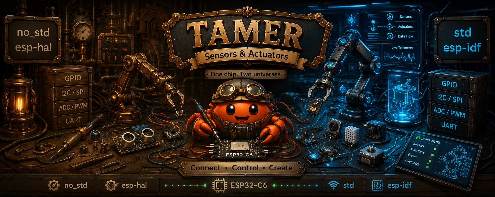
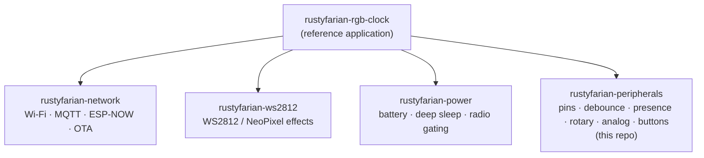

# Rustyfarian Peripherals

<p align="center">
  
</p>

[](https://github.com/datenkollektiv/rustyfarian-peripherals/actions/workflows/rust.yml)
[](#license)
[](https://www.rust-lang.org)
[](https://github.com/datenkollektiv/rustyfarian-peripherals/actions/workflows/fmt.yml)
[](https://github.com/datenkollektiv/rustyfarian-peripherals/actions/workflows/clippy.yml)
[](https://github.com/datenkollektiv/rustyfarian-peripherals/actions/workflows/audit.yml)

Library-only workspace providing hardware peripheral abstractions — input
(pins, debounced presence sensors, debounced switches, rotary encoders, analog
controls, button events) and output (tone/buzzer sequencing) — for ESP32 and `no_std`
embedded Rust projects. No application code, just reusable, composable crates.

> **Note:** Large parts of this library (and its documentation) were developed
> with the assistance of AI tools. All generated code has been reviewed and
> curated by the maintainer.

## Rustyfarian Family

`rustyfarian-peripherals` is one repo in the **rustyfarian** family — composable
embedded-Rust libraries for battery-powered ESP32 field deployments (e.g. remote
beehive monitoring over LoRaWAN). It sits at the bottom of the stack: the layer
that reads the physical world.



| Repo                                                                             | Role                                                                                                 |
|:---------------------------------------------------------------------------------|:-----------------------------------------------------------------------------------------------------|
| **rustyfarian-peripherals** (this repo)                                          | Input peripherals: pins, debounce, presence sensors, rotary encoders, analog controls, button events |
| [rustyfarian-power](https://github.com/datenkollektiv/rustyfarian-power)         | Battery monitoring, deep sleep, radio power gating                                                   |
| [rustyfarian-network](https://github.com/datenkollektiv/rustyfarian-network)     | Wi-Fi, MQTT, LoRa, ESP-NOW, OTA                                                                      |
| [rustyfarian-ws2812](https://github.com/datenkollektiv/rustyfarian-ws2812)       | WS2812 / NeoPixel LED effects (output)                                                               |
| [rustyfarian-rgb-clock](https://github.com/datenkollektiv/rustyfarian-rgb-clock) | Reference application tying the libraries together                                                   |

## Vision

> One home for every hardware peripheral the rustyfarian ecosystem touches —
> buttons, encoders, buzzers, displays, LEDs — each built as pure, host-testable
> logic behind a thin hardware wrapper, so a new device never means a new repo.

**We are building this for:** developers building battery-powered ESP32
applications in the rustyfarian ecosystem who want clean, tested peripheral
drivers without re-writing debounce, quadrature, tone, and framebuffer code per
project.

**Long-term goals:**
- Pure, host-testable peripheral logic in `tamer` (decode *and* render).
- Thin, trait-first esp-hal / esp-idf hardware tiers, each with `Noop*` mocks.
- One repo for many peripherals, input *and* output, grown on demand.

**Out of scope:** network and radio (`rustyfarian-network`), application-level
business logic, and any hardware-only driver that skips the pure `tamer` core.

*Full vision, success signals, and open questions: [VISION.md](./VISION.md)*

## Rustyfarian Philosophy

This library embodies the principle of **extracting testable pure logic from
hardware-specific code** — a pattern common in application development but rare
in embedded Rust.

- **Hardware-independent core:** debounce, digital presence detection, rotary
  quadrature decoding, analog normalization, and button-event timing live in
  [`tamer`](crates/tamer) — plain `no_std` Rust with no hardware dependency,
  always compiled, fully testable on the host.
- **Thin hardware wrappers:** the `rustyfarian-esp-*` crates are minimal
  translation layers between `embedded-hal` pins and the pure logic. Real logic
  stays in the core.
- **Trait-first design:** every hardware interaction is behind a trait, with a
  `Noop*` mock shipped beside it so consumer crates test against the library's
  mocks rather than inventing their own.
- **Demand-driven growth:** primitives are added when a real downstream project
  needs them, not speculatively.

The core logic in `tamer` can be fully unit-tested on your laptop without an
ESP32 or ESP toolchain.

## Crates

| Crate                                                                       | Tier                  | Target   | Contents                                                                                                                                                                        |
|:----------------------------------------------------------------------------|:----------------------|:---------|:--------------------------------------------------------------------------------------------------------------------------------------------------------------------------------|
| [`tamer`](crates/tamer)                                                     | Pure / host-buildable | `no_std` | Debounce, digital presence detection, rotary decoding, analog normalization, tone sequencing, and button-event logic behind traits, with `Noop*` mocks. No hardware dependency. |
| [`rustyfarian-esp-hal-peripherals`](crates/rustyfarian-esp-hal-peripherals) | esp-hal (bare-metal)  | `no_std` | esp-hal GPIO drivers binding `tamer` to real pins. Re-exports `tamer`. **(skeleton)**                                                                                           |
| [`rustyfarian-esp-idf-peripherals`](crates/rustyfarian-esp-idf-peripherals) | ESP-IDF (std)         | `std`    | Interrupt-driven rotary encoder with persistent raw-FFI edge capture. Re-exports `tamer`. First library driver shipping beyond the skeleton.                                    |

The pure core uses the rustyfarian family's funfair naming (`tamer`, joining
`bunting` / `pennant` / `ferriswheel` / `juggler` / `stoker`); the hardware
tiers use the technical `rustyfarian-<hal>-<repo>` convention.

> **Status: growing on demand.** The workspace structure, tooling, and CI are in place.
> `tamer` core modules are complete (debounce, rotary, button, analog, tone). The hardware
> tiers add drivers as real downstream projects need them: `rustyfarian-esp-idf-peripherals`
> now ships the first driver (interrupt-driven rotary encoder). See [ROADMAP.md](./docs/ROADMAP.md).

## Common Tasks

[`just`](https://github.com/casey/just) is the canonical interface; run it with
no arguments to list all recipes. Host work needs only `rustc`, `cargo`, and
`just` — no ESP toolchain.

```shell
just check     # check the host-buildable crates
just test      # run host-side unit tests
just verify    # non-modifying full gate: fmt-check + check + clippy + test
just pre-commit # same, but auto-formats (modifies files)
just doctor    # report tooling status
```

Building the hardware crates for a device needs the Espressif toolchain
(`just setup-toolchain`) and the device target config
(`just setup-cargo-config`). Those recipes, and the `flash` / `run` /
`build-example` family, arrive with the first downstream-driven driver.

## License

Licensed under either of

- [Apache License, Version 2.0](LICENSE-APACHE)
- [MIT License](LICENSE-MIT)

at your option.

Unless you explicitly state otherwise, any contribution intentionally submitted
for inclusion in the work by you, as defined in the Apache-2.0 license, shall be
dual licensed as above, without any additional terms or conditions.
