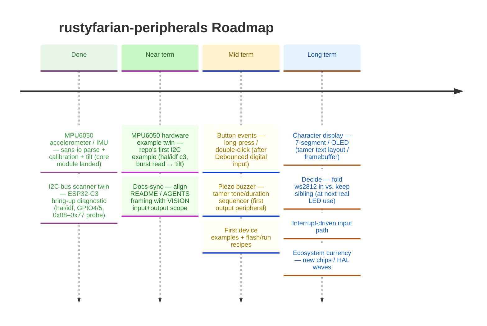

# Roadmap

*Last updated: July 2026*

A re-derived vision broadened this repo from input-only peripherals to a single
home for **all** hardware peripherals — input *and* output (buttons, encoders,
buzzers, displays, LEDs) — so a new device never means a new repo. The workspace
skeleton, tooling, and CI are in place; every crate builds on the host. The pure
`tamer` core plus thin esp-hal / esp-idf tiers is the non-negotiable spine, now
extended to output (tone sequencing, text layout, framebuffer diffing). This
roadmap is **fuzzy by design**: peripherals are added when a real downstream
project needs them, and the order reflects likely demand, not a commitment.
Open questions: whether `rustyfarian-ws2812` folds in, and whether battery /
power devices count as peripherals here (see [VISION.md](../VISION.md)).

---

## Architecture Decisions (Frozen)

These drive every peripheral below — input *and* output.

- **Sans-io boundary:** all decode/render/timing logic lives in `tamer` (pure,
  `no_std`, host-testable). The hardware crates are thin wrappers that read pins
  and push bytes. Nothing host-testable goes inside an esp-hal/esp-idf wrapper —
  output peripherals included (tone sequencing, text layout, framebuffer diffing).
- **Trait-first + mocks:** every hardware interaction is behind a trait, and
  every trait ships its `Noop*` mock in the same change.
- **`embedded-hal` is the seam:** adapters read `embedded_hal::digital::InputPin`
  (and the relevant output/bus traits) behind `tamer`'s `hal` feature and feed
  the pure logic. The pure core leans on `embedded-hal` rather than reinventing it.
- **Two hardware tiers, mirrored layout:** `rustyfarian-esp-hal-peripherals`
  (bare-metal) and `rustyfarian-esp-idf-peripherals` (std) keep parallel module
  structure so a peripheral added to one has an obvious home in the other.
- **Demand-driven:** no peripheral lands without a real consumer.

---

## Near term — Debounced Digital Input

**Goal:** A rustyfarian app can read a bouncing button or switch as clean
press/release transitions, with the debounce logic fully host-tested.

**Likely shape:**

- `tamer::debounce` — a sampled-input debounce state machine (integrator or
  shift-register style), pure and host-tested, plus its `Noop*`/test seam.
- A `hal`-feature adapter that ticks the state machine from an
  `embedded_hal::digital::InputPin`.
- Thin re-exports / wiring in the esp-hal and esp-idf tiers as a consumer needs
  them.

---

## Near term — Rotary Encoder

**Goal:** A rustyfarian app can read an incremental rotary encoder (e.g. a
config knob) as detented steps, debounced and direction-aware.

**Likely shape:**

- `tamer::rotary` — quadrature / Gray-code decoding with detent handling, pure
  and host-tested across the full transition table.
- A `hal`-feature adapter fed from two `InputPin`s (A/B), optionally a third for
  the push switch.

---

## Mid term — Button Events

**Goal:** Higher-level events — press, release, long-press, double-click — built
on top of the debounce primitive, with the timing logic host-tested.

---

## Mid term — Piezo Buzzer

**Goal:** The first *output* peripheral, proving the pure-core discipline holds
beyond input. A rustyfarian app can play tones and simple patterns (beep,
double-beep, alarm) driven by host-tested logic.

**Likely shape:**

- `tamer::buzzer` — a tone/duration sequencer (frequency + on/off timing) as a
  pure state machine, host-tested, with its `Noop*` mock.
- A `hal`-feature adapter that drives a GPIO / PWM output from the sequencer.

---

## Mid term — First Device Examples

**Goal:** Runnable `{driver}_{chip}_{name}` examples (e.g. `hal_c6_rotary`,
`idf_esp32_button`) on real boards, which brings in the `flash` / `run` /
`build-example` justfile recipes and the per-chip flashing scripts (mirroring
the sibling repos).

**Status:** Button, rotary, potentiometer, IR proximity, tilt (motion/orientation),
Reed switch, and Hall-effect sensor examples on ESP32-C3 are working on both
esp-hal and esp-idf tiers (with two Hall paths: linear analog via ADC and digital
switch via `tamer::presence`; see [Feature: Hall-effect Sensing](features/hall-sensing-v1.md)).

---

## Long term — Character Display

**Goal:** Print a line of text or simple glyphs on a 7-segment or OLED display,
with the text layout / framebuffer logic host-tested in `tamer` and the hardware
tier only pushing bytes over the bus.

**Likely shape:**

- `tamer` text/framebuffer layer — glyph maps, line layout, and framebuffer
  diffing, pure and host-tested.
- A `hal`-feature adapter over the relevant `embedded-hal` bus (I²C / SPI).

---

## Long term — `ws2812` Merge Decision

**Goal:** Decide whether `rustyfarian-ws2812` (WS2812 / NeoPixel effects) folds
into this repo as just-another-output-peripheral, or stays a sibling. It was the
first peripheral and predates this repo's broadened scope. Resolve when the
boundary is next tested by a real LED consumer (see [VISION.md](../VISION.md)).

---

## Long term — Interrupt-Driven Input

**Goal:** Feed the pure state machines from pin-change interrupts rather than
polling, for low-power deployments. Resolve the poll-vs-event API question in
[VISION.md](../VISION.md) when the first interrupt-driven consumer appears.

---

## Open Questions

| Question                                                       | Blocks                 | How to resolve                                                                 |
|:---------------------------------------------------------------|:-----------------------|:-------------------------------------------------------------------------------|
| Fold `ws2812` in vs. keep it a sibling?                        | ws2812 merge decision  | Decide at the next real LED consumer                                           |
| Do battery / charging devices count as peripherals here?       | Power-device drivers   | Lean `rustyfarian-power`; revisit if a charging IC needs a driver              |
| Poll-driven vs. interrupt-driven state-machine API in `tamer`? | Interrupt-driven input | Decide when the first interrupt-driven consumer appears                        |
| Which esp-hal / esp-idf wave to pin to?                        | First hardware driver  | Match the wave the sibling repos are on (see their `[workspace.dependencies]`) |
