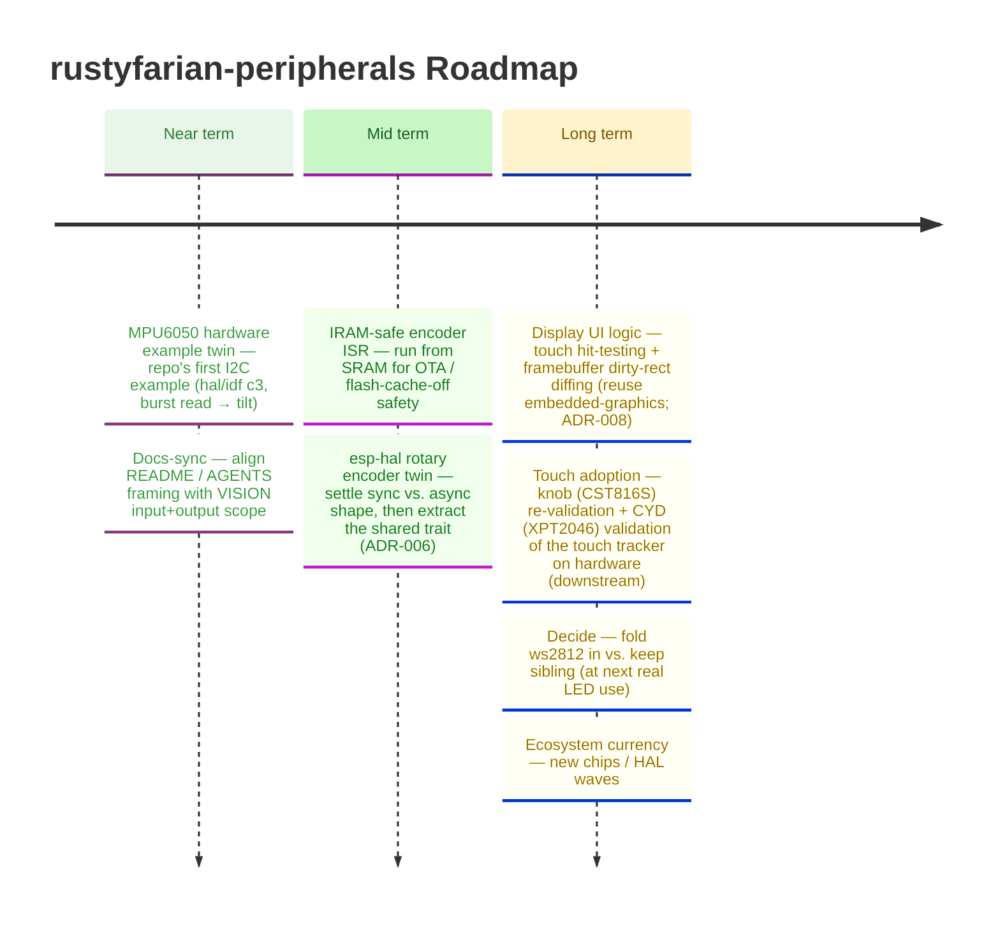

# Roadmap

*Last updated: September 26, 2026*

This repo is the single home for **all** hardware peripherals, input *and* output, so a new device never means a new repo.
The pure `tamer` core plus thin esp-hal / esp-idf tiers is the non-negotiable spine.
The roadmap is **fuzzy by design**: peripherals land when a real downstream project needs them, and the order reflects likely demand, not a commitment.
Shipped work is recorded in [`CHANGELOG.md`](../CHANGELOG.md); this roadmap tracks only upcoming work.

```mermaid
%%{init: {
  "theme": "base",
  "themeVariables": {
    "cScale0": "#e8f5e9",
    "cScaleLabel0": "#2e7d32",
    "cScale1": "#c8f7c5",
    "cScaleLabel1": "#1b5e20",
    "cScale2": "#fff3cd",
    "cScaleLabel2": "#7a5a00",
    "cScale3": "#e3f2fd",
    "cScaleLabel3": "#0d47a1"
  }
}}%%

timeline
    title rustyfarian-peripherals Roadmap

    Near term : MPU6050 hardware example twin — repo's first I2C example (hal/idf c3, burst read → tilt)
              : Docs-sync — align README / AGENTS framing with VISION input+output scope

    Mid term  : IRAM-safe encoder ISR — run from SRAM for OTA / flash-cache-off safety
              : esp-hal rotary encoder twin — settle sync vs. async shape, then extract the shared trait (ADR-006)

    Long term : Display UI logic — touch hit-testing + framebuffer dirty-rect diffing (reuse embedded-graphics; ADR-008)
              : Touch adoption — knob (CST816S) re-validation + CYD (XPT2046) validation of the touch tracker on hardware (downstream)
              : Decide — fold ws2812 in vs. keep sibling (at next real LED use)
              : Ecosystem currency — new chips / HAL waves
```

---

## Architecture Decisions (Frozen)

- **Sans-io boundary:** all decode / render / timing logic lives in `tamer` (pure, `no_std`, host-testable); the hardware crates only read pins and push bytes.
- **Trait-first + mocks:** every hardware interaction sits behind a trait, and every trait ships its `Noop*` mock in the same change.
- **`embedded-hal` is the seam:** adapters behind `tamer`'s `hal` feature read the `embedded-hal` traits and feed the pure logic.
- **Two mirrored tiers:** `rustyfarian-esp-hal-peripherals` (bare-metal) and `rustyfarian-esp-idf-peripherals` (std) keep parallel module layouts.
- **Demand-driven:** no peripheral lands without a real consumer.
- **Exact-pinned esp stacks:** pins follow the wave the sibling repos are on and move via the cycle in [`maintenance-plan.md`](../maintenance-plan.md).

---

## Near term — MPU6050 example twin

**Goal:** the repo's first I2C example on both tiers, feeding `tamer::mpu6050` burst reads into `tilt`.
See [Feature: MPU6050 v1](features/mpu6050-imu-v1.md).

## Mid term — IRAM-safe interrupt handler

**Goal:** run the encoder ISR from SRAM so edges survive flash-cache-off windows (NVS / OTA writes).
Today the encoder is not IRAM-safe and can crash if an edge arrives during a flash write.
Pending decisions: compile-time opt-in vs. always-on, and where `QUAD_TABLE` lives.
See [Feature: IRAM-Safe ISR v1](features/iram-safe-isr-v1.md).

## Long term — Display UI logic

**Goal:** own only the pure UI-logic gaps above a display, never a display abstraction ([ADR-008](adr/008-display-scope.md)).
Rendering stays with `embedded-graphics`, layout with `embedded-text` / `embedded-layout`, and bus / rotation / backlight glue with the chip tiers.
Two modules land on demand: touch-region hit-testing (`TouchPoint` → region id, composes `tamer::touch`) and framebuffer dirty-rect diffing.
`tamer` takes no `embedded-graphics` dependency, even feature-gated; APIs freeze only at a second consumer.

## Long term — `ws2812` merge decision

**Goal:** decide whether `rustyfarian-ws2812` folds in as just another output peripheral or stays a sibling.
Resolve when a real LED consumer next tests the boundary (see [VISION.md](../VISION.md)).

---

## Open Questions

| Question                                                 | Blocks                | How to resolve                                                    |
|:---------------------------------------------------------|:----------------------|:------------------------------------------------------------------|
| Fold `ws2812` in vs. keep it a sibling?                  | ws2812 merge decision | Decide at the next real LED consumer                              |
| Do battery / charging devices count as peripherals here? | Power-device drivers  | Lean `rustyfarian-power`; revisit if a charging IC needs a driver |
